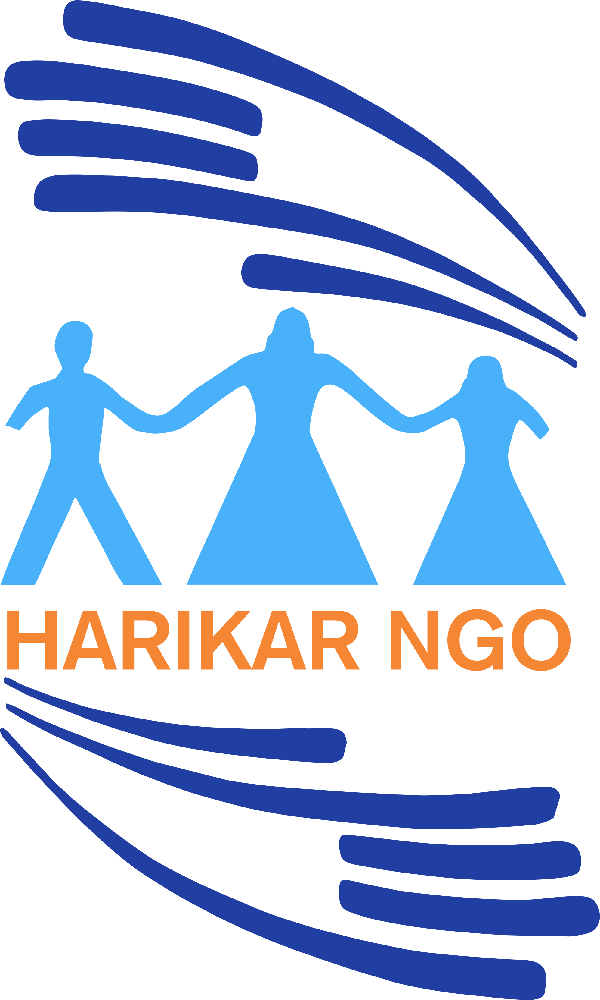

---
title: |
  {width=0.6in} \ \ \ \ 
  \color{harikar} \fontsize{28}{12} \selectfont Vacancy Announcement
header-includes: |
  \usepackage{fancyhdr}
  \usepackage{graphicx}
  \usepackage{eso-pic}
  \usepackage{transparent}
  \usepackage{geometry}
  \usepackage{xcolor}
  \usepackage{sectsty}
  \pagestyle{fancy}
  \fancypagestyle{plain}{}
  \addtolength{\headwidth}{\linewidth}
  \fancyheadoffset{\textwidth}
  \geometry{includeheadfoot,top=0in,left=1in,right=1in,bottom=0.5in}
  \definecolor{harikar}{rgb}{0.29,0.38,0.65}
  \sectionfont{\color{harikar}}
  \subsubsectionfont{\color{harikar}}
  \fancyhf{}
  \lfoot{\includegraphics[scale=1]{img/address.png} \color{harikar} Iraq-Kurdistan – Duhok \\ \ \ \ \ Medya – Str. / Australia   }
  \cfoot{\includegraphics[scale=1]{img/unit.png} \color{harikar} HR Unit \ \ \ \ \ \ \ \ \ \ \ \ \ \includegraphics[scale=1]{img/phone.png} 0751 414 8317}
  \rfoot{\includegraphics[scale=1]{img/web.png} \color{harikar} www.harikar.org}
  \renewcommand{\headrulewidth}{0pt}
  \renewcommand{\footrulewidth}{1pt}
  \AddToShipoutPictureBG{\AtTextLowerLeft{\put(+90,+100){\transparent{0.1}\includegraphics[width=4in]{img/Harikar.png}}}}
---

Job Title: Community Service Assistant  
Project Name: Protection and Assistant Programme for Refugees and IDPs in Duhok – Iraq  
Project Area: Domiz 2 Camp  
Vacancy Ref No: 60  
Applicants Residence: Duhok  
Preferable Gender: Male  
Duration of Appointment: 50 Days  
Expected Starting Date: 9 November 2021  
Deadline: 31 October 2021  
Type of Contract: Employment Contract  
WorkingHours: 8:00AM \_ 3:30PM

### Background:

Harikar NGO is a neutral, non-governmental, non-profit humanitarian organization established on 30th May 2004 by a group of social activists. Harikar NGO as stated in its mission statement strives toward the fulfilment of human and women rights in Dohuk Governorate as stipulated in the new Iraqi constitution of 15th October 2005. Harikar is committed to- within its resources- contribute towards the achievement of the internationally agreed Millennium Development Goals. Harikar believes in human rights, the right of every person to reach his/her potential without discrimination on the basis of race, gender, religion, social segment and ethnicity. Harikar strives to achieve social justice especially among the marginalized vulnerable groups and works towards eliminating all forms of discrimination against women by promoting their capacity to fully participate in community development. Harikar has been able to successfully carry out more than 80 projects, through funding from various partners including UNFPA, RRT/PRT, UNHCR, UNESCO, UNICEF, UNOCHA, Diakonia, UNDP, UNOPS, IRD, Mercy Corps, CARE International, ASB, GIZ, Acted, IRC, IRI, NDI, SCF-UK, Mission east, ICSP and others.

# Terms of References

### Job Overview:

Community Service Assistant, under the direct supervision of Assistant Project Manager for Refugees at Harikar NGO, will respond to community services needs of Syrian refugees and asylum seekers in Domiz 2 camp in Duhok governorate. The Community Service Assistant provides counselling to the people of concern to UNHCR and guides them to have access to the basic social services set in place. The Community Service Assistant will undertake the following tasks and responsibilities;

### Scope of Work (Duties and Responsibilities):

- Work closely with partners working in the area of community development to identify concerns to the community and implement community development programs and projects as recommended.
- Based on established methodologies provide general information to refugee population settled in Domiz 2 camp.
- Encourage and facilitate informal groups of Syrian refugees to meet, discuss issues, and make support networks.
- Identify and refer cases to the concerned service providers pending the consent of survivors.
- Conduct home visits, interviews and focus group discussions to identify issues related to living conditions of refugees and provide relevant recommendations for interventions.
- Based on assessments, provide counseling support to the people of concern.
- Based on the conducted assessments, make referral to relevant services providers for counseling, legal aid, social welfare, shelter, health, education, livelihoods, child protection.
- Make regular follow up of cases identified and assisted to ensure that interventions are carried out in timely manner
- Ensure that individual cases identified and referred are properly documented using vulnerability assessment forms, ProGres, BIA/BID and information is treated in utmost confidentiality
- Offer mediation to settle despites where possible except for cases that involve violence, abuse, neglect and exploitation.
- Conduct regular visits to schools to identify and monitor attendance, psychosocial issues and the situation of children with special needs
- Provide periodic reports as required.
- Keep comprehensive data on each case identified and assisted as per UNHCR guidelines and SOPs.
- Ensure that data is shared with relevant actors based on the principles of confidentiality.

### Additional Duties and Responsibilities:

- Attend and participate in trainings, workshops and other capacity building exercises as required by the line manager;
- Community Service Assistant is a member of Harikar emergency protection monitoring team; responds to any emergency situations that might occur in KR-I border points with Syria and Turkey.
- Fulfil other duties as required by your line manager.

### Experience, Qualifications and Skills:

- Educational Qualifications:

  - A university degree in humanitarian science and sociology, persons with alternative but clearly related degrees in combination with strong relevant work experience can be considered.

- Professional Experience:

  - Able and or flexible in visiting Domiz2 camp and or other refugee camps.
  - Preferably a minimum of 3 years of relevant work experience in protection.
  - Proven skills and experience in case mechanisms and referral mechanisms.

- Skills:
  - Knowledge of English is mandatory; it is strongly recommended the applicant can speak and write English language very well.
  - Very good understanding “written and oral” in Arabic and Kurdish language skills.
  - Advanced computer skills, particular Microsoft Word, Excel, Power Point and Outlook. familiar working with database and IT issues.
  - Very good communication and interpersonal skills. Candidate needs to be flexible and creative, respectful and diplomatic. Results-driven and highly motivated to assist the most vulnerable amongst refugees.

### Reporting and Supervision

Reports to: Assistant Project Manager for Refugees

Supervises: None

### Expected Conduct:

- Ensure that confidentiality is always maintained when sharing data and information about persons of concern;
- Work with the Harikar/UNHCR protection team in a cooperative and collaborative manner;
- Maintain cooperative relationships with partners;
- Maintain high professional and ethical standard when both on and off duty, including upholding the principles and practices set out in the Code of Conduct and adhering to international standards;
- Seek guidance and technical support when needed with “Do no harm” principle being the priority at all times.

### Commitment:

- All Harikar staff must be committed to the Core Humanitarian Principles as well as the Core Humanitarian Standards in Accountability and Quality Management
- All Harikar policies and guidelines are an integral part of this Job Description and must be implemented, e.g.:
  - Harikar operational guidelines and Policies.
  - Guideline prevention of corruption.
  - Guideline on PSEA.
  - Harikar Code of Conduct
  - Child Safeguarding
